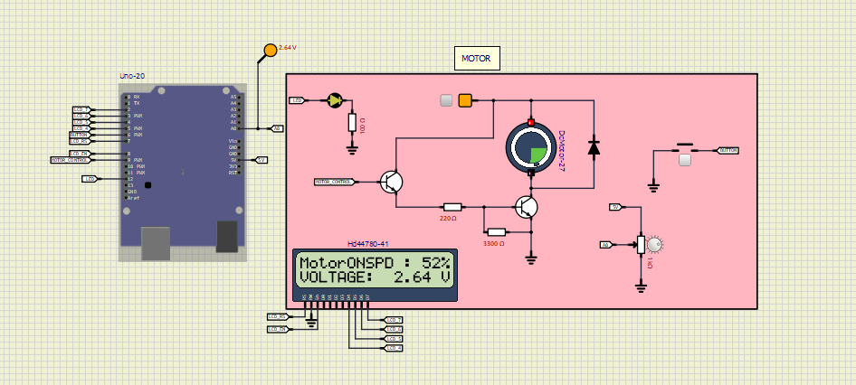

# Motor-Control
Simulation of a PWM-based motor control with LCD monitoring, built in SimulIDE and Arduino IDE
This project demonstrates a basic motor control system using an Arduino Uno, simulated in SimulIDE. The motor speed is controlled via PWM, the LCD displays real-time voltage and ON/OFF state, and serial communication (USART) provides logs to the monitor. Includes .sim1 simulation file, Arduino .ino sketch, and compiled .hex file

## 🔧 Features

- Control motor speed using PWM
- Display motor ON/OFF state and voltage on LCD
- USART logging to serial monitor
- Built in SimulIDE with schematic provided

## ⚙️ Description of Operation
- The motor is driven by PWM from the Arduino Uno and its speed is controlled based on the input voltage.
- An LCD displays the motor status (`ON/OFF`), applied voltage, and calculated motor speed.
- **Speed Calculation:**  
  The speed (%) is proportional to the applied input voltage relative to the maximum supply voltage of 5V

- The LCD shows both the percentage (%) and the real-time voltage value.
- An LED indicator will turn **ON** when the motor speed exceeds 50%.

## 🚀 Project Files
- `MotorLogic.ino` → Arduino Code
- `Motor_Firmware.hex` → Compiled hex
- `SchematicLayout.sim1` → SimulIDE project file
- `Layout.png` → Project schematic screenshot

## ⚠️ Known Issues
- Motor toggle sometimes fails to update correctly.
- USART1 logs are not showing in SimulIDE serial monitor.

(Feel free to fix and submit a PR!)

## ▶️ How to Run
1. Open `MotorControl.sim1` in **SimulIDE**.
2. Upload `MotorControl.hex` into the Arduino board inside SimulIDE.
3. Open the serial monitor to view USART logs.
4. Adjust motor control input to test speed variation.
